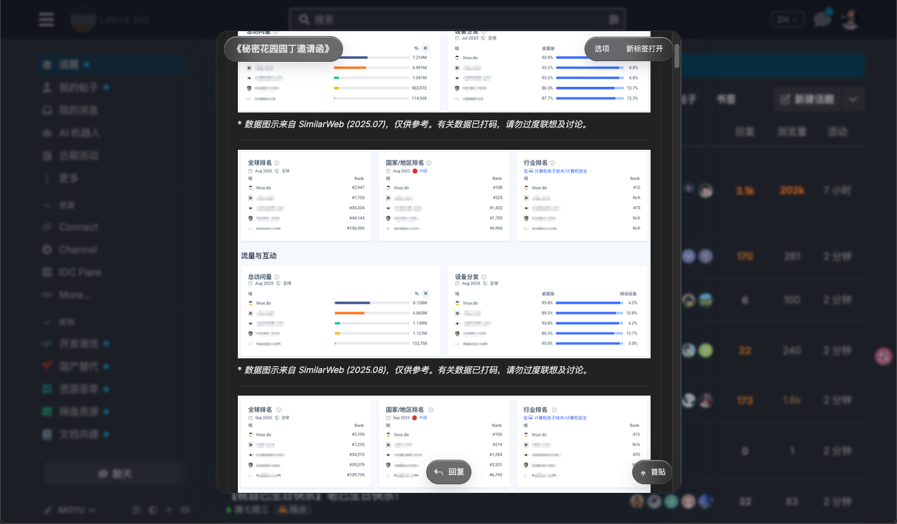

# Linux.do 悬浮预览
Linux.do Peek View / Linux.do 悬浮预览
> 在 `Linux.do` 内以悬浮窗口方式预览帖子，减少来回跳转，保留连续阅读体验。
 
## 界面预览
 

  

## 为什么做这个

在社区里连续刷帖时，频繁进入主题页、返回列表、再重新找回刚才的位置，成本很高。  
这个扩展的目标很直接：

- 不离开列表，就能快速看帖
- 能从上次已读位置继续往下读
- 看到一半继续加载时，不打断阅读节奏
- 常用操作直接在浮层内完成

## 核心体验

### 悬浮预览

点击主题标题后，帖子会在悬浮窗口中打开，而不是整页跳转。

- 保留原列表上下文
- 支持新标签页打开原主题
- 点击空白处可自动关闭悬浮窗口

### 已读定位

再次打开主题时，会尽量回到上次已读位置附近。

- 支持深已读点定位
- 支持定位后继续向下自动续载
- 支持楼层回复跳转及返回

### 连续阅读

当已加载内容不足时，向下滚动会继续加载后续帖子。

- 使用底部流动加载带提示
- 接近底部时会提前预取
- 后续帖子按分阶段方式补入，优先恢复可继续滚动的阅读节奏
- 底部续载使用骨架卡片占位
- 到达最底部且无更多内容时，触发特定线性光效反馈
- 尽量保持阅读动线连续

### 直接交互

在浮层中即可完成高频操作。

- 点赞
- 收藏
- 快速回复
- 粘贴图片自动上传
- Markdown 输入与快捷发送

### 轻量 UI

扩展整体尽量贴近 `Linux.do` 社区气质，而不是做成完全割裂的新界面。

- 右上角 `宽度` 按钮可打开滑块胶囊，无级调节悬浮宽度
- 标签支持图标展示
- 标签过多时自动折叠，并通过 `>` 悬浮展开
- 底部提供悬浮回复按钮

## 安装

### Chrome / Edge

1. 打开扩展管理页
   - Chrome: `chrome://extensions`
   - Edge: `edge://extensions`
2. 打开 `开发者模式`
3. 点击 `加载已解压的扩展程序`
4. 选择当前仓库目录
5. 打开 `https://linux.do/`

## 使用

1. 进入 `Linux.do` 主题列表
2. 点击帖子标题
3. 自动打开悬浮预览
4. 点击右上角 `宽度` 可用滑块连续调整预览宽度
5. 继续滚动即可自动续载后续帖子，靠近底部时会提前预取
6. 续载过程中底部使用骨架卡片占位，后逐步替换为真实内容
7. 直接在悬浮页中完成点赞、收藏、回复等操作

## 社区支持
- [LinuxDO](https://linux.do)